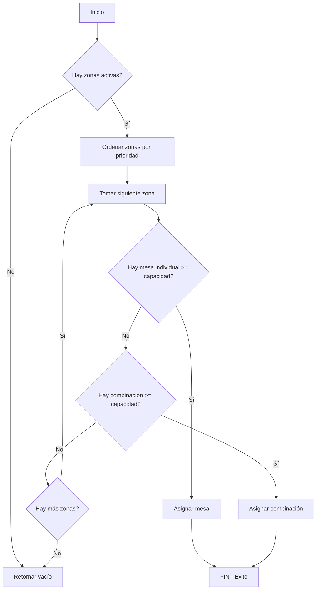

# 🎯 LÓGICA DE ASIGNACIÓN DE MESAS

## 📋 Algoritmo de Asignación

La función `assign_tables_to_reservation` sigue esta lógica:

### 1️⃣ Orden de Prioridad: POR ZONAS

```
Zona 1 (priority_order = 1)
  ├─ Buscar mesa individual óptima
  └─ Si no hay, buscar combinación óptima

Zona 2 (priority_order = 2)
  ├─ Buscar mesa individual óptima
  └─ Si no hay, buscar combinación óptima

Zona 3 (priority_order = 3)
  ├─ Buscar mesa individual óptima
  └─ Si no hay, buscar combinación óptima
```

### 2️⃣ Dentro de Cada Zona

**PASO 1: Mesas Individuales**
- Buscar mesa con capacidad >= comensales
- Ordenar por capacidad ASC (más ajustada primero)
- Si encuentra una, asignarla y **TERMINAR**

**PASO 2: Combinaciones**
- Solo si no hay mesa individual disponible
- Buscar combinación con capacidad >= comensales
- Verificar que TODAS las mesas de la combinación estén disponibles
- Ordenar por capacidad total ASC (más ajustada primero)
- Si encuentra una, asignarla y **TERMINAR**

**PASO 3: Siguiente Zona**
- Si no hay opciones en esta zona, continuar con la siguiente

---

## 🔍 Ejemplos de Asignación

### Ejemplo 1: Mesa Individual Disponible
```
Solicitud: 4 personas
Zona 1 (Comedor):
  - Mesa A: 4 personas ✅ DISPONIBLE
  - Mesa B: 6 personas ✅ DISPONIBLE
  - Combinación C+D: 8 personas ✅ DISPONIBLE

Resultado: Asigna Mesa A (4 personas)
Razón: Es la más ajustada y está en la zona de mayor prioridad
```

### Ejemplo 2: Solo Combinación Disponible
```
Solicitud: 8 personas
Zona 1 (Comedor):
  - Mesa A: 4 personas ✅ DISPONIBLE
  - Mesa B: 6 personas ✅ DISPONIBLE
  - Combinación A+B: 10 personas ✅ DISPONIBLE

Resultado: Asigna Combinación A+B (10 personas)
Razón: No hay mesa individual de 8+, combinación es la más ajustada
```

### Ejemplo 3: Zona Preferida Llena, Usar Siguiente
```
Solicitud: 4 personas
Zona 1 (Comedor):
  - Mesa A: 4 personas ❌ OCUPADA
  - Mesa B: 6 personas ❌ OCUPADA
  - Combinación A+B: 10 personas ❌ NO DISPONIBLE

Zona 2 (Terraza):
  - Mesa C: 4 personas ✅ DISPONIBLE
  - Mesa D: 6 personas ✅ DISPONIBLE

Resultado: Asigna Mesa C (4 personas) en Zona 2
Razón: Zona 1 no tiene opciones, pasa a Zona 2
```

### Ejemplo 4: Zona Preferida Especificada
```
Solicitud: 4 personas, Zona Preferida: Terraza (ID: xxx)
Zona 2 (Terraza):
  - Mesa C: 4 personas ✅ DISPONIBLE
  - Mesa D: 6 personas ✅ DISPONIBLE

Resultado: Asigna Mesa C (4 personas) en Terraza
Razón: Zona preferida tiene prioridad absoluta (CASE WHEN = 0)
```

---

## 🎯 Criterios de Optimización

### 1. Prioridad de Zona
```sql
ORDER BY 
    CASE WHEN z.id = p_preferred_zone_id THEN 0 ELSE 1 END,
    z.priority_order ASC
```
- Si hay zona preferida, va primero (0)
- Luego por `priority_order` (1, 2, 3...)

### 2. Capacidad Más Ajustada
```sql
ORDER BY t.capacity ASC  -- Mesas individuales
ORDER BY tc.total_capacity ASC  -- Combinaciones
```
- Busca la opción con menor desperdicio de capacidad
- Ejemplo: Para 4 personas, prefiere mesa de 4 sobre mesa de 6

### 3. Disponibilidad Real
```sql
is_table_available(t.id, p_date, p_start_at, p_end_at, NULL)
```
- Verifica que la mesa no esté ocupada en ese horario
- Para combinaciones, verifica TODAS las mesas

---

## 🔄 Flujo Completo



---

## ⚙️ Parámetros de la Función

```sql
assign_tables_to_reservation(
    p_reservation_id uuid,        -- ID de la reserva
    p_date date,                  -- Fecha de la reserva
    p_start_at timestamptz,       -- Hora de inicio
    p_end_at timestamptz,         -- Hora de fin
    p_guests integer,             -- Número de comensales
    p_preferred_zone_id uuid      -- Zona preferida (opcional)
)
RETURNS uuid[]                    -- Array de IDs de mesas asignadas
```

---

## 🚨 Casos Especiales

### Sin Zona Preferida
```sql
p_preferred_zone_id = NULL
```
- Busca en TODAS las zonas
- Orden: priority_order ASC (1, 2, 3...)

### Con Zona Preferida
```sql
p_preferred_zone_id = 'xxx-xxx-xxx'
```
- Busca SOLO en esa zona
- Si no encuentra, retorna vacío (no busca en otras zonas)

### Sin Opciones Disponibles
```sql
RETURN ARRAY[]::uuid[]
```
- No asigna nada
- La reserva queda sin mesas asignadas
- El frontend debe manejar este caso

---

## 📊 Ventajas de Esta Lógica

✅ **Respeta prioridad de zonas**: Zona 1 completa antes de pasar a Zona 2  
✅ **Optimiza capacidad**: Busca la opción más ajustada  
✅ **Prefiere mesas individuales**: Menos mesas ocupadas = más flexibilidad  
✅ **Usa combinaciones solo si necesario**: Evita bloquear múltiples mesas innecesariamente  
✅ **Maneja zona preferida**: Cliente puede solicitar zona específica  
✅ **Seguro**: Limpia asignaciones en caso de error  

---

## 🔧 Mantenimiento

### Actualizar Prioridad de Zonas
```sql
UPDATE zones 
SET priority_order = 1 
WHERE name = 'Comedor';

UPDATE zones 
SET priority_order = 2 
WHERE name = 'Terraza';
```

### Desactivar Zona Temporalmente
```sql
UPDATE zones 
SET is_active = false 
WHERE name = 'Terraza';
```

### Ver Orden Actual de Zonas
```sql
SELECT id, name, priority_order, is_active
FROM zones
ORDER BY priority_order ASC;
```
